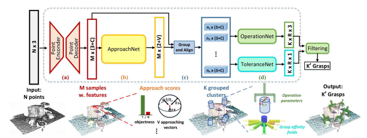

# distributed-deep-learning-final-project
2024-2 빅데이터기반 분산-딥러닝 혁신 프로젝트  
프로젝트 제목: Distributed Training을 통한 GraspNet 모델 학습 속도 향상  
학과: SW융합대학 컴퓨터공학과  
이름: 이철민  

## 프로젝트 설명
GraspNet은 복잡한 장면에서의 물제 grasp 문제를 해결하기 위한 학습데이터와 평가기준의 부재를 해결하기 위해  
97,280개의 RGB-D 이미지와 10억개 이상의 grasp pose를 포함한 대규모 데이터셋과 통합 평가 시스템을 제공한다.  

제안된 네트워크는 point cloud를 입력으로 하여 grasp pose 예측하며 접근 방향과 동작 매개변수를 분리하여 학습하고,  
grasp 견고성을 높이기 위해 새로운 grasp affinity field를 설계하였다.  

이 모델은 PoineNet을 백본으로 사용하고 있으며 구조는 다음과 같다.  

